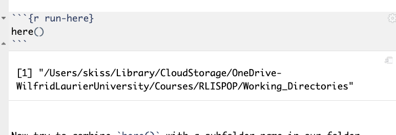

```{r setup, include=FALSE}
knitr::opts_chunk$set(echo = F, fig.align="center")
library(knitr)
library(here)
```

# Working directories

Your *working directory* is the folder on your computer in which you are currently working. When you ask R to open a certain file, it will look in the working directory for this file, and when you tell R to save a data file or figure, it will save it in the working directory.

When you open up RStudio - without opening up a `.rproj` file (e.g. a project), the default working directory is your home directory on your computer.  You can tell what your working directory is by running the command `getwd()` either in the console or in the R script. 

Try it. 

Open up RStudio *without openening an `.Rproj` file or a project and run `getwd()` and see what you get.  I get this:

```{r skiss-home, include=T}
include_graphics(here("images/getwd_users.png"))

```


Working directories can be *changed* with the commmand `setwd()`. I'm going to set mine to be my `Documents` folder on my hard drive. You try it too. This will have to change depending on what your general documetns folder is called and whether or not you work on a Mac or a PC. But give it a try. 

```{r setwd, eval=T, echo=T}
#Set the working directory
setwd("~/Documents")
#Check to see if it worked
getwd()
```
OK, so far so good. 

However, this is ultimately unsatisfying for a very simple reason. Everyone's computer is different. PCs home directories start with `c:/` and Mac home directories start with `Users/user_name`. Also, people download packages of files we are working and might not store them in `Documents` . It might be called `My documents`. This is going to be a problem in this way.

Look in the folder that this lesson is located. Check to make sure that you are *not* in a project and that the working directory is somewhere other than this folder. 

But select `File > Open File` and navigate to the file in the folder `Working_Directories` called `import.R`. 

Open it and run the script, line-by-line or top-to-bottom. You should see this error:

```{r file-error}

include_graphics(path=here("images/warning_cant_find_file.png"))
```

The reason is that R is starting in the working directory returned by `getwd()` and adding the path name `data/test.csv` to and it's not finding it, because *it is not there*. 

Now, we could modify `import.R` by putting a `setwd()` command at the top but this presents a problem. When we are sharing our work with others, we *have no idea what their computer folder structre looks like!* Is it a Mac? Or a PC? Have they saved their folders on the desktop? Or in their `Documents` folder?

For an amusing description of this problem, please see this [page](https://github.com/jennybc/here_here). 

There are very easy practical solutions to this problem. The first is to *always* - and I do mean *always* - think and work in terms of `RStudio` projects. These are defined by files that end in `.rproj`. Usually I define one project per analysis. 

<!-- When I move `test.R` to my `Documents` folder, I still get this.  -->

<!-- This causes problems because most people keep their files and projects organized in subfolders.  -->

<!-- So you need to tell R where to go look for a data-set to import.  -->

<!-- So, if I make a sub-folder for a project in `~/Documents/Test/` and I put my R script in there and I put my data-set in there, then I need to specify to R to go look in that folder. I can do that in two ways.  -->

<!-- 1. I can force R to look in that folder with an `absolute path`.  -->

<!-- ```{r absolute, eval=F, purl=F} -->
<!-- df<-read.csv('~/Documents/Test/test.csv') -->
<!-- ``` -->
<!-- 2. Or at the beginning of the script, I can set the working directory to be `~/Documents/Test/` like this -->

<!-- ```{r setwd, eval=F, purl=F} -->
<!-- setwd('~/Documents/Test/') -->
<!-- ``` -->

<!-- And then I can run the import command.  -->

<!-- ```{r import, eval=F, purl=F} -->
<!-- df<-read.csv(file="test.csv") -->
<!-- ``` -->

<!-- Both of these solutions are problematic for the simple reason that they *will not be reproducible on y our end.* Because you do not necessarily have the same folder structure that I do! -->

<!-- We don't need to worry too much about this in this class, because we are working in RStudio Cloud; but it's *really* important to learn, nonetheless.  -->

<!-- RStudio has developed a *really* powerful and simple way to deal with this problem that I want you to learn. -->

### Projects

An RStudio project is a particular type of file, with the extension `.rproj` that does a few things, but mostly, all it does is it automatically sets the working directory to be **wherever the `.Rproj` folder is.**

You can open RStudio projects by select `File > Open Project` or by double-clicking an `.rproj` file. 

Let's see what happens. 

Start by running `getwd()` and make note of where you are. Check to see if you are in an RStudio project by looking in the top-right of the RStudio panel. Hopefully it says `Project: None`. 

```{r no-project}
include_graphics(here("images/no_project.png"))
```

Now, select `File > Open Project` and navigate to the folder where this lesson is located and open the file. Open `Working_Directories.Rproj`. 

Now, look again at the top right. You should see this. 

Also, run `getwd()` again. This time you should get this: 

```{r project-working-directory}
include_graphics(here("images/show_project_working_directories.png"))
```

and now, the *pièce de résistance*, open the file `import.R` and run the script from top to bottom. 

I'm going to guess you successfully have imported a little fake data frame containing information on age and vote choice. 

```{r imported-df}
include_graphics(here("images/df.png"))
```


What I can do with this, is I can send a link to this folder via `OneDrive`, or host it on Github, or zip it up and e-mail it to someone and *as long as they open the `.rproj` file to get into the proper working directory, the script will work in exactly the same way. 

<!-- RStudio Cloud automatically makes a `.rproj` folder called `project.rproj` everytime you set up a project, so you actually don't need to worry about it that much. But if you were to download your package to your computer, open it up on your own computer, by opening the `.rproj` file in rstudio, the working directory would immediately be the folder where the `.rproj` file is; right where it should be.  -->

<!-- That solves the problem of setting the working directory. We can then use the very simple and powerfule 'here()' package to build paths to folders relative to this project file *wherever and whenever anyone opens a version of the folder on any computer.* -->

## The `here()` package. 

The `here()` package is a next-level improvement on this problem and I insist we use it as much as possible. 
If you have not installed it, please do so and then load it.

```{r install, message=F, warning=F}
#install.packages('here')
library(here)
```

The `here` package provides just the `here()` command. Run it and see what it does.

```{r run-here}
here()
```

Essentially, it creates an `absolute path name` starting with *your* root directory down to the working directory of the project you are in. 

Now try to combine `here()` with a subfolder name in our folder. But the amazing thing is, when *I* open up and run `here()` on my computer, `here()` will generate a path name that is appropriate to *my computer*. But then when I e-mail you the package of files to work on, it will generate a pathname that is appropriate to *your* computer.


```{r here-data}
here("data")

```


<!-- Watch:  -->

<!-- ```{r example-here, include=F} -->
<!-- here() -->
<!-- ``` -->
<!-- ```{r here-image, echo=F, purl=F} -->
<!--  -->
<!-- ``` -->

### Organized folders

A final note on keeping your folders organized. It is not *necessary* but it is *highly* desirable to organize the folders in your workspaces carefully and logically. Coding can get messy very quickly.

You *should* get in the habit of maintaining clear folders for all the different types of material your project will entail.

At a minimum, there should be one subfolder for your data and one sub-folder for your graphs.
