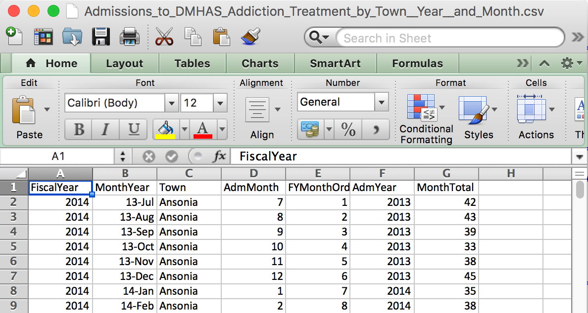
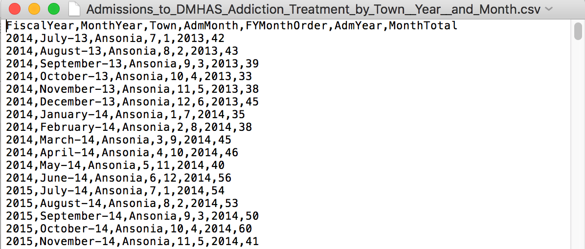
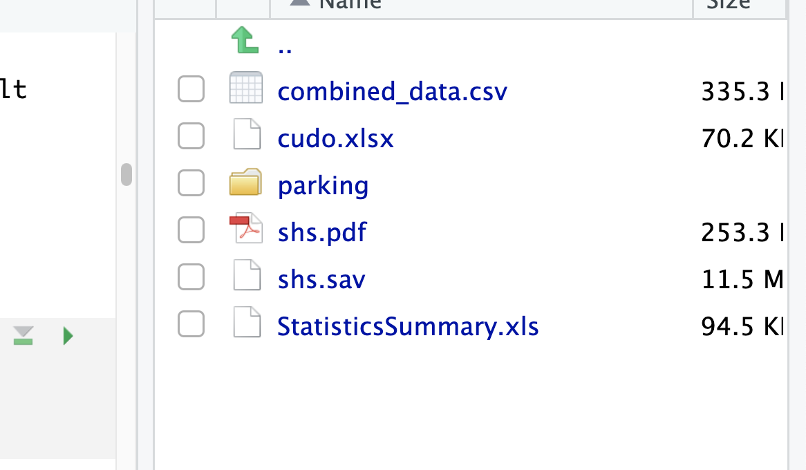
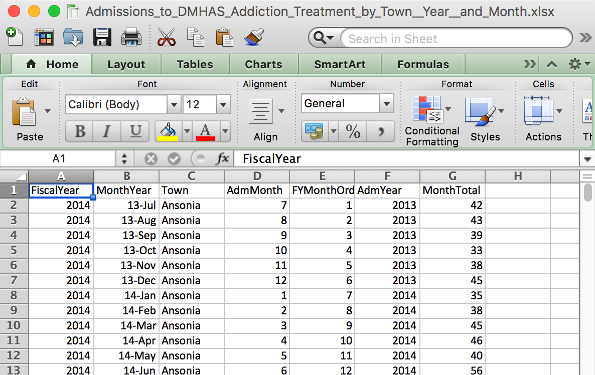
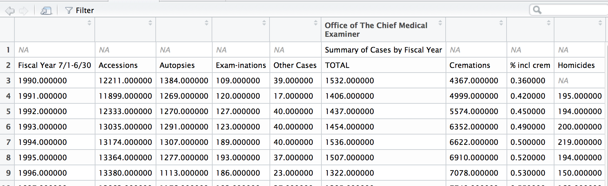
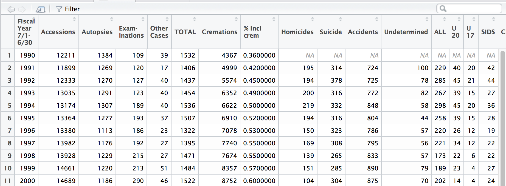

# Load libraries

For this we will need the following libraries:

```{r}
#General
library(tidyverse)
#For file paths
library(here)
#For cleaning names 
library(janitor)
#For webscraping
library(rvest)
#For bulk csv and excel files
library(muckrakr)
#For reading excel files
library(readxl)
#For importing SPSS data
library(haven)
library(labelled)
```

Comma separated files are the most common way to save spreadsheets that doesn't require a paid program from Microsoft to open.

## What a csv file looks like

CSV file names end with a **.csv**

```{r img1, echo = F, out.width="100%"}
library(knitr)

```


## What a csv file looks like on the inside

This explains the values separated with commas part of the file name.


```{r img2, echo = F, out.width="100%"}

```


# Importing CSV files

- `read.csv` is a function provided in base R.
- `read_csv` is a function provided in the `readr`. Both work well. 


We have stored a series of CSV files from the City of Toronto in the folder `data/parking`. 
Let's import the first one.  Note: the best way to access data in subfolders is to use the `here()` function in the `here` package

If you have not installed it, please do so.

```{r install}
#install.packages('here')
library(here)
```

The `here` package provides just the `here()` command. Run it and see what it does. 

```{r run-here}
here()
```

Now try to combine `here()` with a subfolder name. 

```{r here-data}
here("data")
```


```{r segment2}
df_csv <- read.csv(file=here("data/parking/Parking_Tags_Data_2024_1.csv"))
```

## Bulk CSV

Sometimes we have to read in multiple csv files at once. 

But with R, you can script that process. There is a custom function in the `muckrakr` package that does this really well. You have to download the **muckrakr** package off of GitHub with the **devtools** package.

Note: This assumes that each CSV file is structured in exactly the same way!!!! 

```{r install_muckrakr, warning=F, message=F}
# If you don't have devtools installed yet, uncomment and run the line below
#install.packages("devtools")
devtools::install_github("andrewbtran/muckrakr")
library(muckrakr)
library(here)

```

The function we want to use is called `bulk_csv()`.

It looks like this (**Don't run this command, it's theoretical**):

```{r example, eval=F}
?bulk_csv
bulk_csv(folder = "DEFAULTBULKCSV2017", export = "filenamedefaultbulkcsv2018.csv"")
```

Two arguments: 

* folder - The folder in relation to your working directory where the csv files exist. Default folder is the current working directory.
* export - File name to export csv file as, if wanted.

Alright, so within this project folder is a sub folder full of CSVs. 


```{r csvs, echo = F, out.width="100%"}
library(knitr)

```


It's in `data/csvs`


> **PRO-TIP**  
This package is based on readr, so passing on variables from read_csv will work in bulk_csv. These variables will apply to the import of each CSV sheet.


To create a new dataframe with all the data sets combined, the command would be:

```{r bulk_csv, message=FALSE, warning=FALSE}
library(here)
here()
list.files('data/parking')
combined_data <- bulk_csv(folder=here('/data/parking'))

```

# Importing Excel Files
Excel spreadsheets are unique in that they can contain multiple spreadsheets as a workbook.

## What an Excel file looks like

Excel file names end with a **.xls** or **.xlsx**


```{r img_excel, echo = F, out.width="100%"}
library(knitr)

```


## Importing Excel files
- Importing Excel is complicated, **readxl package** is needed
- There are more other packages that handle Excel files and can build extra sheets, but we won't be needing them for this instance

Unlike a csv, you can't just copy and paste the URL for an Excel sheet. 

You gotta download the file first. For now, I've provided the excel file in the `data` subfolder. For your own use, you should be prepared to save excel spreadhseets to a similar subfolder.

## read_excel()

Excel spreadsheets have multiple sheets and it's best to explore what it looks like in Excel first because `read_excel()` requires specific sheets to be referred to when importing.

Give it a shot with the first sheet.

```{r first_sheet, eval=F}
df_xl <- read_excel("data/StatisticsSummary.xls", sheet=1)
```

Check it

```{r view1, eval=F}
View(df_xl)
```

```{r img5, echo = F, out.width="100%"}

```


**This isn't right**. 

The problem with Excel files is that people love to format it in ways that make it look nice in Excel but makes no sense in R.

## read_excel() again


But this time we'll add `skip=2` so it skips the first rows when bringing in the data.

```{r skip}
df_xl <- read_excel("data/StatisticsSummary.xls", sheet=1, skip=2)
```

Much better

```{r view2, eval=F}
View(df_xl)
```

```{r img6, echo = F, out.width="100%"}

```


**Warning**: Notice that the column names are preserved with spaces and symbols.


```{r df_xl}
# the names() function lists the column names of the dataframe
names(df_xl)
```

So how would one refer to the data in the columns with spaces

If we did it like normal with the `$` to pull the column we'd try

```{r df_xl_col_fail, error=T}
head(df_xl$Other Cases)
```

See, spaces won't work. This is how to deal with columns with spaces-- add the back tick next to the 1 button on your keyboard.

```{r df_xl_col_pass, error=T}
head(df_xl$`Other Cases`)
```

It's some extra finger work that you might be okay with if it was in a limited basis.

However, in anticipation of the work we're going to be doing, we should go ahead and simplify the column names so there are no characters or spaces. Here's how

<!-- ## Cleaning (part 1) -->

<!-- We'll use the `clean_names()` function from the `janitor` library on the data frame. This function makes syntactically valid names out of character vectors (as in in strips out the spaces and replaces them with periods) -->

<!-- ```{r next} -->
<!-- library(janitor) -->
<!-- df_xl <-clean_names(df_xl) -->
<!-- ``` -->

<!-- Check it out: -->

<!-- ```{r check-names} -->
<!-- names(df_xl) -->
<!-- ``` -->


<!-- Alright, that's a bit better.  -->

<!-- Still, there's some oddness in the names but that's because enters were replaced with periods. -->

<!-- Check out the first column: `fiscal_year_7_1_6_30` -->


<!-- Here's how to do it with `dplyr`, which is a significant library in the `tidyverse`: By using the `rename()` function. -->

<!-- ```{r rename2, warning=F, message=F} -->
<!-- ## If you don't have dplyr installed yet, uncomment the line below and run it -->
<!-- # install.packages("dplyr") -->

<!-- library(dplyr) -->
<!-- df_xl <- rename(df_xl, Year=fiscal_year_7_1_6_30) -->
<!-- ``` -->

<!-- Check it: -->

<!-- ```{r names_again} -->
<!-- names(df_xl) -->
<!-- ``` -->

<!-- Note, you can also rename variables by their position! So if we want to turn `Exam.inations` to `Examinations`, we just count which position it's in: 4. -->


<!-- ```{r rename4, warning=F, message=F} -->

<!-- df_xl <- rename(df_xl, Examinations=4) -->
<!-- ``` -->

<!-- ```{r check-names2} -->
<!-- df_xl -->
<!-- ``` -->

<!-- Fix the other names if you want. I'm going to leave them as is for now. -->


### Bulk Excel files

Same concept as above, but the function name is `bulk_excel()`.


# One Excel workbook with multiple worksheets

Sometimes, we have a situation where we have one Excel workbook with multiple worksheets. In some situations, one worksheet 

```{r excel1, echo=F}
include_graphics(here("images/multiple_worksheets.png"))
```


```{r read-sheet}

dat<-read_excel(here("data/cudo.xlsx"), sheet=3)
```

What happens though if we want to import multiple sheets?

The first thing we do is to make an object that is a file path to where the Excel workbook is stored. 

```{r make-path}
file_path<-here("data/cudo.xlsx")
```

Now, we need to use the function `excel_sheets()` to get the names of each worksheet in the workbook. We will store them in an object called `sheet_names`.

```{r sheet-names}
sheet_names<-excel_sheets(file_path)
```
now, we will do something quite fancy which is to loop over each item in `sheet_names` with the `map()` function and run the function `read_excel` and we will supply the argument `file_path` to `read_excel`.

So basically we will be telling R to go to the file location where our excel workbook is, read in the worksheet with the first name, then go and do it again and do it again. 


```{r map}
mydat<-map(sheet_names, read_excel, path=file_path)
```

Now look in the top right corner, you should see something that looks like the object `mydat`.
```{r excel-mydat, echo=F}
include_graphics(here('images/mydat.png'))
```

If we look at it, we can see that there are some problems. Namnely there is junky white space above the data that we really need and there is a bunch of junky stuff below all the fun data that we don't need. 

If you pull up the help file for `read_excel` then you can look at some of the options that you can set. 
```{r help}
?read_excel
```

Specifically, you can order Excel to skip some lines. 


```{r multiple-worksheets, echo=F}
include_graphics(here("images/multiple_worksheets.png")) 
```

Inspecting the raw workbooks. We can count that the first six rows are junk and everything past row 33 is junk. Two arguments can help us `skip` and `n_max`. `skip` says how many rows to skip over and `n_max` says to read at most that number of rows. So, we can want to *start* at Row 7 (so skip=6) and we want to stop at Row 33, so `n_max` 33-7 (26). 

```{r skip2}
mydat2<-map(sheet_names, read_excel, path=file_path, skip=6, n_max=26)

```

Now, we are not quite done yet. If we call `class()` on our new precious we will see it is a list.

```{r list}
class(list)
```

This means that each year's data is really stored as a separate item. 

*If* each data-set in each list item is *excactly* the same, and thankfully, it appears to be the case in this data-set, then we can *easily* smush them together in one function. 

Let's test this. 

Right now, we have 18 list items of 26 rows each. 

```{r math}
18*26
```

So, in total we have 468 rows of data. 
We can use the `bind_rows()` function which literally just ....binds all the rows together (assuming they are the same type of columns!!)

```{r bind-rows}
mydat3<-bind_rows(mydat2)
```

And how many rows do we have now? 
```{r nrow-mydat}
nrow(mydat3)
```

Ta-da! Nicely smushed together!!!

But wait, it gets better. Now, unfortunately, we have lost the very valuable information about which year each row of data comes from. 

No fear: We can modify the `bind_rows()` function like this. 

```{r help-bind-rows}
?bind_rows
```

We can use the `.id` argument to specify a new variable that will be filled with the values of the name of the list. And remember, we named each list item from the year of the data!!!
So, we can do:

```{r id-year}
mydat3<-bind_rows(mydat2, .id="Year")

```

Now we have a whole data frame showing the retention rates for each Ontario university from 2003 to 2012.

```{r run-summary}
summary(mydat3)

```

And if we look at the actual variable `Retention Rate`, we see that it has been miraculously been imported not as a character string with a junky percent sign you would have to deal with, but as a proper number, i.e. 50\% is 0.5000. You might consider multiplying that by 100 and saving it in a new variable, but we'll get there. 

```{r percent}
mydat3$`Retention Rate`
```

Potential pitfalls:

1. There may be different numbers of rows in each worksheet, i.e. the data may be poorly formatted. If you set the same criteria for import here, it may miss some data. 
2. There may be hard to read characters somewhere (e.g. @, ! #)


# Scraping Data From Tables

We can use some functions in the `rvest` library which is part of the `tidyverse`. It works really well. 

First we make the url so we don't have to type it again and again. 

```{r make-url}
news<-'https://en.wikipedia.org/wiki/List_of_newspapers_in_Canada_by_circulation'
```

Then, we read the HTML code at that URL. 
```{r getnews}
#Read in the html
news_table<-read_html(news)
#Check to see what you have
glimpse(news_table)
```

Next, we need to select all the html tags of the form `table<>`
```{r newspapers}

html_nodes(news_table, "table")

  

```

It looks like there are are six different tables on the webpage, and we have gotten them all. But we really only want the one that has the newspaper on it. How do we figure out which one to select? There are different options. The first thing to do is to figure out what we are dealing with:

```{r check-class-nodeset}
class(news_table)
```

OK, it is an `xml_node`. That's basically the results of taking part of a webpage. To get the `nth` element of a nodeset, we can use `[]` in a chain of commands in conjunction with `.`. 

Watch and then play around changing the table nodes you extract.

```{r check-node1} 

html_nodes(news_table, "table") %>% 
  .[1]
```

This is tough to read, but if you go back to the website and actually look at the source code, by selecting `View > Developer > Source Code` in Chrome, you can actually find some of the text in each table.

It turns out we need the 3rd table. 
```{r check-node6} 

html_nodes(news_table, "table") %>% 
  .[3]
```

Now, we need to run `html_table()` *on that table*, and save the results into a new data frame. 

```{r clean-html}
html_nodes(news_table, "table") %>% 
  .[3] %>% 
  html_table()->newspapers
```

Then we need to turn it into a data frame. 
```{r data-frame}
#Turn to data.frame
newspapers<-data.frame(newspapers)

```

Check again: 
```{r summary-newspapers}
glimpse(newspapers)

```

et Voila!


# SPSS Files

SPSS is a very popular software program for statistical analysis of social science data. It is often used to store survey data used by public opinion researchers and Statistics Canada because you can store survey responses as `factors` and not just as numbers as in `csv` files. 

If you are looking at `individual` level data from Statistics Canada, you will often get data in this format. 

Here, I've provided the 2017 version of Statistics Canada's *Survey of Household Spending*. It is in the `data` subfolder. 

```{r household-spending}
list.files(path=here('data'))

```

We use the `haven` package to import SPSS files that have a `.sav` extension.

```{r load-haven}
library(haven)
library(labelled)
shs<-read_sav(here('data/shs.sav'))
```

One thing that is difficult with a lot of these big surveys is they ask *a lot* of questions, so it can be hard to find the variables you want. There's nothing wrong with opening up the technical documentation that comes with teh file to search for which questions were asked. But `haven` provides a function that basically lets you search through the question texts which are techincaly known as `variable labels`. 

```{r look-for}
lookfor(shs, 'internet')
lookfor(shs, 'income')
lookfor(shs, 'rent')

```

You can also do a `View()` and look at the whole document. 

```{r view, results='hide', eval=F}
View(var_label(shs))

```


# APIs
## Twitter data

R works very well with lots of APIs, including Twitter. The package `rtweet` lets you import twitter data quite quickly.  A full tutorial is [here](https://cran.r-project.org/web/packages/rtweet/vignettes/rtweet.html). The trick is that you need to register with twitter with some steps spelled out there. 


```{r,get-tweets, eval=F}
library(rtweet)
laurier <- search_tweets("laurier", n = 100, include_rts = FALSE)
laurier
```

```{r get-spottedn, eval=F}
#Get timelline of a twitter account
spotted<-get_timeline(user="spottedlaurier")
#Check
glimpse(spotted)

```

Now you can read the text:

```{r read-text, eval=F}
  users <- search_users("r")
  tweets_data(users)
```


