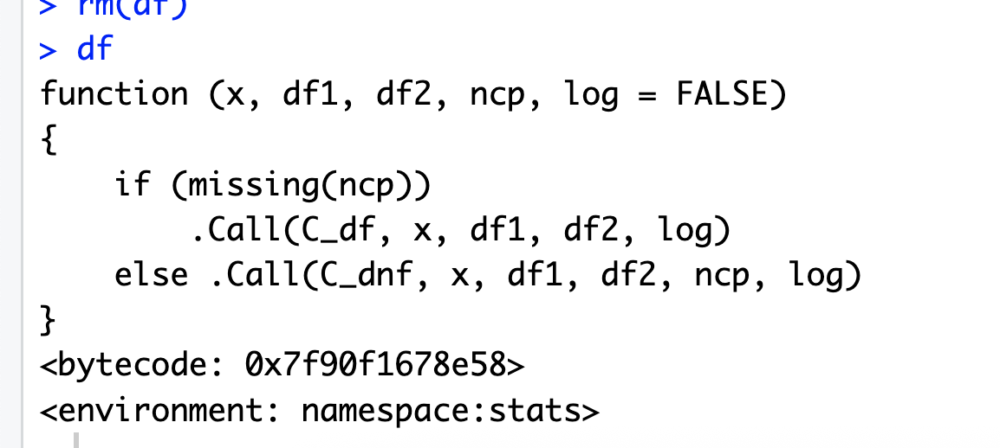

```{r setup, include=FALSE}
knitr::opts_chunk$set(echo = T, message=F, warning=F)
library(knitr)
library(here)
```

```{r remove-df-function, echo=F, eval=F,results='hide', purl=F}
df<-NULL
df
```

# Introduction

R is a scripting or programming language designed specfifically for statistical analysis and data visualization. 

You must follow pretty specific syntax rules for it to work. R won't guess for you.

* R is case-sensitive 
* Can enter commands at in the console, at the prompt `>` or in batch
  - Almost exclusively we should be writing commands in a script file, i.e. a file with a `.R` extension. We can use one-off commands at the console. 
* Comments are preceded by `#`
    * This is important to use often in your code for documentation
    * You'll see it often in this course

You can enter commands in either the console, next to the `>` character *or* in a `script` file. 95\% of your work will be done in the latter way. 

Let's practice. Enter the following commands in a script file. 

Select `File > New File > R Script`. 


## Calculator. 

We can do basic arithmetic functions like addition. 

```{r add}
1+2
```

Note: Just because you've entered the command in the script, doesn't mean it has been *executed*. 

There are multiple was to do so, but for now, the easiest way is to be sure your cursor is on the line you want to execute and hit `CMD-Return` on a Mac or `Ctl-Enter` on a PC. 

We can do subtraction...

```{r subtraction}
2-1
```

Multiplication...

```{r multiplication}
2*2
```

and division....

```{r division}
10000/25
```

## Assignment

An essential next step is learning to *assign* the results of commands to certain short-hand names or objects. Our above mathematical operations have been conducted, but the results of our mathematical operations have been dissipated into the ether! They are gone!

However, we can save them by assigning the results to another short-hand object with the `<-` character.

```{r assign}
#Store the results of 1+2 in `a`
a<-1+2

```

It can be a bit hard to think of this, but the way I think about it as the sentence: `a` gets the results of `1+2`. 

Look up in the right-hand corner. Now, you'll see the letter `a` and a `3` next to it. This means that, in R's current memory, we have an object called `a` that represents the number `3`.

We can call a, just be running it as a command. 

```{r assign2}
a
```

And now we can even do math with it:

```{r assign3}
a+3
```

You can also reverse the assignment operator. Down the line, this becomes important as we will start working with `pipes` and command chains.

This is a bit more logical as in: Store the results of `1+2` in `a`
```{r assign4}
1+2->a

```

## The Script Is Where The Work Is

One of the most important things to get your head around working with a programming language as opposed to a GUI-based piece of software is that the work is done by the script; it's a mini-computer program. The important thing to save is the *script* and not the work environment. 

The key insight here is that the work done in R is actually done in the *scripts* that we write. When we compute using point-and-click, those steps are *not repeatable*. That's why we have such habits to save, save, save save as again and again, once you've done something successfully. 

But in programming, the script does the work the same time again and again, and with small data-sets it will do it in the blink of an eye. 

To quote a leading R programmer, Hadley Wickham:

> As a beginning R user, it’s OK to consider your environment (i.e. the objects listed in the environment pane) 'real'. However, in the long run, you’ll be much better off if you consider your R scripts as 'real'.

To illustrate the importance and the utility of this, we can clear our workspace or environment (synonyms) by just clicking on the little broom in the top-right of Rstudio (See Figure \@ref(fig:clear-objects)).

```{r clear-objects, echo=F, purl=F, fig.cap="Clearing objects"}
include_graphics(path="images/clear_objects.png")
```

You should see a warning sign pop up like this:

```{r clear-objects-warning, echo=F, purl=F, fig.cap="Warning about clearing objects"}
include_graphics(path="images/clear_objects_warning.png")
```

A warning like this is often discomforting to students because you are thinking in GUI-space; like you do not want to lose your term paper. But the workspace is not your work. The *script* is your work. Go ahead and click ``yes``.

Now try to call that object `a` again. 

You're going to get this error.

```{r a-not-found, fig.cap="a not found", echo=F, purl=F}
include_graphics(path=("images/a_not_found.png"))
```

That's OK! All our work is in the *script* So, we just have to run the script again. We're going to learn various ways of running the script next. 


## Executing code in RStudio. 

There are multiple ways to execute your script in RStudio, and I'm going to point out the three most frequent ways to execute code. 

1. **Line-By-Line** Lastly you can execute code *or a selection of lines* line-by-line. The keyboard short-cut for this is **CMD-Return** on a Mac and **Ctl+Enter** on a PC. This option works great after you have run the beginning section of a script and you are now working through line-by-line additions or if you are specifically trying to troubleshoot one section of code. 

2. **Top-to-Cursor** This runs the code from the top of the script to wherever your cursor is. You can do it from the menu `Code > Run Region > Run From Beginning To Line.` (See Figure \@ref(fig:code1) ) However, it's *a lot* more efficient to use keyboard shortcuts. On Mac, this is **Opt-CMD-B**. On a PC, it is **Ctl+Alt+B**.  This option works great when you know you have a bunch of code that works but you maybe had to stop for the day and pick it up the next. Or, maybe an error is popping up; you clear your workspace, move the cursor up a few lines, run the code from top to there to get caught up and then find where the error is popping up. 

```{r code1, fig.align="center", echo=F,  purl=F, fig.cap="Running code"}
include_graphics(path=here("images/code.png"))
```

3. **Source** The simplest way is to `source()` the script which runs *everything* in the script, from top to bottom (see Figure \@ref(fig:source)). But I *don't* actually recommend you use this very often. This is really used when code is complete, tested and works great. This is really only ever at the end.

```{r source, fig.align="center", echo=F, purl=F, fig.cap="Sourcing code"}
library(here)
include_graphics(path=here("images/source.png"))
```

That is the destination of where we're headed; but getting there is a much messier and iterative process involving testing, trial and error and fixing. 


# Vectors

In this section we are going to make a series of `vectors` of data. A vector is just a collection of the same type of data (e.g. numbers, words, letters, dates), strung together. You *cannot* mix and match data types in a vector. 

The command to make a vector is `c()` which is short for `combine`. 

You string together the elements of the vector separating each with a comma. 

For example. We could put numbers in a vector:

```{r numvec1}
c(1,2,3,4,5,6)

```

Notice though we didn't assign that vector to anything. Let's do so:


```{r vec1}
#Assign vec1
vec1<-c(1,2,3,4,5,6)
#Print vec1
vec1
```

Here's how you string together some words. Like, let's say you have a a data-set of different housing types. You might encounter a vector of words like this:

```{r vec2}
#Assign to housing
c("house", "condo", "apartment", "house", "condo")
```

Repeat that exercise but assign those to a vector named `housing`

```{r housingvec}
#Assign to housing
housing<-c("house", "condo", "apartment", "house", "condo")
housing
```


# Class exercise

Let's make some vectors of data relevant to this class. 

Pretend you are in a class of five students. Invent a first name, last name, sex, age and date of birth for each. 

Make a vector each for the first names of students in the class, the last names of students in class, their sex and their date of birth.  Store the vectors in a series of objects named `first_name`, `last_name`, `sex`, `age`, and `dob`

> **PRO-TIP**  
> Avoid mixing upper and lower case names for vectors and objects until the *end* of your analysis. It makes typing harder than necessary (you need to keep pressing the shift-key to get the upper cap). As well, avoid whitespace wherever you can, sometimes R chokes on whitespace and you need to embed objects names that have white-space in them, but that's extra typing. So, `first_name` is *a lot* better than `First name`. 

I'll start with my own information. Extend each vector with similar data points 

```{r make-fake-data, echo=T, purl=T}
#first name
first_name<-c('Simon')
#last name
last_name<-c('Kiss')
#Sex
sex<-c('Male')
#age
age<-c(46)
#date of birth
dob<-c('1976-08-14')

```

# Data Frames

For the moment, those vectors are all alone in the universe, with no relationship to each other. But, really we would like them to be tied together into something like a spreadsheet. R's equivalent of a spreadsheet is a `data frame`. Where a vector is a string of elements, a data frame is a collection of vectors of different types (e.g. numbers, words) organized into rows and columns. Each column has a name or header. We make the data frame with the `data.frame()` command. We list each of the items that compose the data frame in the parentheses, separating them with commas. We can provide a column header (more accurately `variable name`) for each item at the same time.


```{r make-df, eval=F}
#Make a data frame with first_name from the vector first_name
data.frame(first_name=first_name)
#Make a data frame with first_name and last_name
data.frame(first_name=first_name, last_name=last_name)
```

Note that the variable names *do not have to match the names of the free floating vector*. So this works just fine. 

```{r change-names, eval=F}
data.frame(variable1=first_name, variable2=last_name)
```

So let's go ahead and make a dataframe with all the varibles above that we constructed. Let's assign the data-frame to an object name like `df`. 


```{r make-data-frame, echo=T, purl=T}
df<-data.frame(first_name=first_name,
               last_name=last_name,
               dob=dob,age=age, sex=sex)
```

> **PRO-TIP**  
> Naming data frames is an art. You will be typing the names of them *a lot*, so something with long letters and a mix of upper and lower case is not a good idea. For example, MylargeData_Set would be a really inefficient name for a data frame. `df` is used *a lot* because it usefully stands for `data frame`. But it also doesn't really tell us what is in the data frame. For more complicated projects, you may end up with two or three data frames that require merging, in which case you may want to keep informative names, e.g. class_names. Another consideration is that you don't want to overwrite existing names of R functions. In this case, we might want to use `names` or `class`, but both of those are R functions. If we save our data frame as those, we lose those functions. Not good! You really cannot go wrong with things like `df` or `dat` or `mydat`. 


## Accessing variables in a data frame

Now that we have strung together our vectors into a data frame (spreadsheet) we can actually still access each individual vector in a particular way, namely we use the `$` operator to pull out the individual vectors. 

If we assume that we have named the data frame `df` then this will work. 

```{r individual-vectors, eval=F}
#Get the first name variable 
df$first_name

```

Practice using the `$` operator to access the other variables in the data-set. 

```{r practice}
#Practice getting the other variables
```

# Functions for working with objects

R comes pre-built with a series of commands that *do* things that we need. These are the equivalent of the commands you select from the menus of software using a GUI. The technical term in R is a `function`. Here are a few major functions you will use that come in pre-built versions of R. 

For functions to work, you need to first open parentheses after the function's name, and then enter in one or multiple `arguments` to the function. These are the *inputs* to the function; and the function uses them to do some work. 

`length(x)` - Find out how many things there are in an object like a vector. 

```{r length, eval=F}
length(df$first_name)
```

`ncol(x)` - Counts the number of columns of a data frame or a matrix [^1]. 


```{r ncol, eval=F}
ncol(df)
```

[^1]: A matrix is like a data frame in that it is numbers organized into rows and columns. The difference between a matrix and a data frame is that matrices can *only* contain numbers, while data frmes can hold character variables or numeric variables and data frames have useful attributes like variable names (just like headers).

`nrow(x)` - Returns the number of rows of **x**

```{r nrow, eval=F}
nrow(df)
```


`str(x)` - Returns the structure of **x**

```{r str, eval=F}
str(df)
```

`summary(x)` - Summarizes the object as understood by R

```{r summary, eval=F}
summary(df)
```


`View(x)` - A command to open the object to browse in RStudio

```{r view, eval=F}
View(df)
```

`rm(x)` - Removes **x** from the workspace, i.e. deletes it!


So, we can safely delete our `df` data frame like this. 

```{r rm2, eval=F}
#Delete 
rm(df)

```

Now try to find it again. 

```{r find-df, echo=T, eval=F}
df
```
You should get a weird output like this:

```{r show-df-function, echo=F}

```

Basically this appears because there is a built-in function in R called `df`. And when we removed our data frame `df`, R gave us the original function back. It is a rarely used function, so overwriting it is not a huge deal. 

But, we actually want that data frame back. So, go back into your script and comment out the command `rm(df)` with a `#` in front of it. Now, execute your code again from the top to the bottom. 

```{r rm3, eval=F}
#Delete 
#rm(df)

```

# Libraries

All of the functions that are listed above are in the original version of R, known is `base R`. The moment you open R up you have access to them. 

But as open source software, this just scratches the surface of what R can do. People all over the world write their own functions to accomplish certain tasks and publish these in *packages* or *libraries* [^2]. 

You can think of these as mini-apps or software that you purchase or download from the internet. To get them to work, you need to go through two steps: first, you need to download and install them and second, you need to open them. 
Let's try to install and load the `janitor` package, which has some really handy data-cleaning tools. 

```{r eval=F}
install.packages('janitor')
```

Now, we've downloaded and installed the `janitor` package. But we can't use the functions in it until we *load* it in our script to make the commands available. 

```{r eval=F}
library(janitor)
```


To get a list of all installed packages, go to the packages window or type `library()` in the console window. If the box in front of the package name is ticked in the packages window, the package is loaded and the functions within it are ready to be called.

[^2]: Frustratingly, the two words mean the same thing, but we have to use `package` in some situations and `library` in others.


## Base R versus the Tidyverse

This gives us the chance to introduce something called the `tidyverse`. R has a long history, dating back to the 1970s. Because of it's open source nature a lot of different people have contributed a lot of different features to it which makes some of its syntax ....quirky. Around 2010, a group of collaborators developed something you might call a *dialect* of R which introduced a few features to make it work better and easier. 

Everything you have been working with up until now has been what is called base R. From here on out, as much as possible we will be working with the `tidyverse`. 

The functions associated with the `tidyverse ` are stored in a number of separate packages; you can install and load the main ones in this way. 

<!-- Rstudio Cloud has the `tidyverse` already installed, so we should not need to install it. Instead, we should just be able to load the library.  -->

```{r load-tidyverse}
#install.packages('tidyverse')
library(tidyverse)
```

Now we can move on to inspecting and summarizing our data frame. 

# Data Types

## Inspecting data frames

Whenever we make or import data the first thing that we should do is inspect the data frame in order to get a feel for what we have. 

RStudio offers a nice summary of the different objects in our environment in the top right panel see Figure (\@ref(fig:df-image)).

```{r df-image, echo=F, purl=F, fig.cap="A data frame"}
include_graphics(path="images/data_frame.png")
```

See `df`? That is our `df` object. In the HTML document here, I've made a fake data-frame with only my details, so it tells us that `df` has 1 observation (row) and 5 variables (columns). 
Right away, this is extremely useful to watch going forward.  

The `summary()` command is one of the most important commands you'll use and you should use it *right after* important a data-set. 


Let's do that with our `df` data frame.

You should see something like this.

```{r summarydf}
summary(df)

```
And the `tidyverse` version of `summary()` is `glimpse()`. 

```{r glimpsedf}
glimpse(df)
```

Using `glimpse()` we get the same information about rows and columns. We also get the first few values printed of our data frame, so we have a sense of what our variables contain. But I want to draw your attention to the second column of the output. 
Notice that four of the five variables has `chr` and 1 of the variables has `dbl`. These tell us what type of data classes each variable is.  

## Data types and levels of measurement

One of the most important concepts in all of statistics is the concept of `level of measurement`. R recognizes different *types* of data because this is so foundational to statistical analysis. The two broadest categories of data types are *categorical* and *numeric* variables. In R, *categorical* variables can be stored as either *character* vectors or as *factors*. *Numeric* variables can be stored as *numeric*, *double* (e.g. allows for decimals) or *integer* variables (e.g. 1, 2, 3...no decimals!). Let's take a look at the difference. 


### Characters

Let's print the variable `first_name`.
```{r class_first_name}
df$first_name

```

OK, notice that there are quotation marks around the names. This is a classic way R notes that something is a `character` variable. To illustrate the difference let's quickly make two separate vectors. 

Let's make `vec1` with five instances of the number 1 *without quotation marks around the 1s*. 

```{r}
vec1<-c(1, 1, 1, 1, 1)
```

And let's make `vec2` the same length, but with quotation marks around each `1`. Note: they can be single or double, but they have to be consistent. 

```{r}
vec2<-c("1", "1", "1", "1", "1")
```
Now compare the two:

```{r}
vec1
vec2
```

See the difference? `vec1` is stored as an actual *number* and `vec2` is stored a series of symbols that just *look* like a 1. 

Try to add 1 to `vec1` and `vec2`. 
```{r addvec1}
vec1+1

```

```{r addvec2, error=T}
vec2+1
```


### Factors

So `character` variables are a type of *categorical* variable. But there is a different type of categorical variable in R called a *factor*. The major difference between the two is that character variables are stored as the actual words and letters. 

Factors are actually a kind of short-cut for character variables, but they have some *major* advantages that make them inidspensable, even the default for categorical variables. 

To get a bit technical, factors are actually stored as *numbers* and then there is a table of `levels` attached to each number. So in the case of our `sex` variable of `male` and `female`, as a `character` class variable, each instance of those variables are stored *as those words*. But when we convert it to a factor, the information is stored as a *number* with just one table that converts the number to a level. So, in our case, when we convert `sex` to a factor, it will be stored as 1s and 2s, and there will only be one table that says something like, `1` should be printed as `male` and `2` should be printed as `female`. 

There are *two* major advantages to using factor. First, it saves on memory, so it's more efficient. More importantly though, you can *change* the order of the levels to communicate important information. 

by default, the categories that are in a `character` variable are printed *alphabetically*, so, if we were to print a table of our our `sex` variable, the numbers of females would be printed first, then the number of males. 

But, often, there is a kind of important order to the categories of a factor. For example, if we had a `character` variable of province of residence, it would print any results or graph starting with Alberta and ending with Quebec. But there are lots of subtle bits of ordering in the names of provinces we might want to communicate. For exampe, we might want to print results from west to east, so we might want the factor levels to start at British Columbia and end at Newfoundland. Or, we might want the two biggest provinces first, so we might want the first levels to be Ontario and Quebec. 

We can convert it a `character` variable to a `factor` with a function called, surprise!, `factor()`. 

Let's, turn `sex` into a factor and store it as the variable `sex_factor`, then let's print `sex` and `sex_factor` to see what the look like. 


```{r factor_sex}
#Step 1
factor(df$sex)

```

Notice one problem, we didn't actually *save* it to anything, so the results disappeared. 

Let's save it to something called `factor_sex`. 

```{r factorsex2}
factor_sex<-factor(df$sex)
# factor_sex
```

OK, so that worked. Look at how in contrast to when it was a character variable, it produces a `levels` result that tells us what the factor levels are and what order they are in. That's always a great clue to whether you are dealing with a factor or not. 

But look up in the top right, screen, notice that we have our data frame, `df` and it *still* only has five variables (Figure \@fig::factor-sex-2).  And we have our new `factor_sex` object store separately; our factor *is not attached to the data frame*. 
```{r factor-sex-2, purl=F, fig.cap="Attaching a variable to a data frame"}
include_graphics(path="images/factor_sex.png")
```

We can verify this is the case by with `glimpse()` or `summary()`
```{r glimpse}
glimpse(df)
```

We can easily attach this factor variable to the data frame by using the `$` that we learned above. 

We're just going to make a new variable, attached to `df` that is the result of factoring the original `sex` variable. 
```{r factorsex3}
#Factor the sex variable and store it attached to the data frame
df$factor_sex<-factor(df$sex)


```

You can see the results by printing the variables one by one and glimpsing. 

```{r factorsex4}
#print the original
df$sex
#Print the new one
df$factor_sex
#Glimpse
glimpse(df)
```

There will be a lot more work on factors but we will finish off our brief introduction of how *categorical variables* are stored as either `character` or `factor` variables. 

### Numeric variables

Numeric variables are a lot simpler. There are three types, `numeric`, `double` and `integer`. `numeric` and `double` variables are basically identical; it's just a historic legacy that there are two different names. Both allow for decimals, but `integer` variables do not. 

### Dates

Dates are a tricky beast in any statistical software for two reasons. First, they straddle the line between categorical variables and numeric variables. On the one hand, there is a numeric order to them; one day follows the next. But it's hard to do math with them in the way that you can with numbers. What is 1+December 31st, 2022? The other problem is that you can represent a date in innumerable ways. 

December 31, 2022, 
Dec. 31, 2022
31 December 2022
12/31/2022
31/12/2022
22/31/12

are all perfectly reasonable ways to record the same date. What a nightmare. 

to minimize this, R has a universal format for storing dates which is always YYYY-MM-DD. 

In order for something to be recognized as a date, it has to be converted to that format. 

Right now, our `dob` variable is stored *just* as a character variable.

```{r date}
glimpse(df)
class(df)

```

So if we were to do a table or a graph of the birth dates of people in the class, then R wouldn't really be able to do anything with this. 

When our date variable is nicely stored as YYYY-MM-DD, which ours is, it is a quick conversion using `as.Date()`

```{r}
#Try converting dob to date
as.Date(df$dob)
#Store it
df$dob2<-as.Date(df$dob)
#Compare
glimpse(df)
```


#### Converting between types

There is an entire suite of `as.XXXX` functions that convert variables into different types. There is: 

- `as.Date(x)`
- `as.factor(x)`
- `as.character(x)`
- `as.numeric(x)`
- `as.integer(x)`

They all do the same thing. They convert the class of the argument `x` into something else. 

However, when dates are stored in other formats, like, say `Oct 01-25`, it is a bit trickier. There are advanced packages that make it work quite easy, but that's beyond the scope of this tutorial.

```{r convert, eval=F}
#Try to convert first_name to a number
as.numeric(df$first_name)
#Try to convert sex to a number
as.numeric(df$sex)
#Try to convert factor_sex to a number
as.numeric(df$factor_sex)
#Try to convert age to an integer
as.integer(df$age)

```


<!-- # Lists -->

<!-- Another basic structure in R is a *list*. -->

<!-- The main advantage of lists is that the "columns" they're not really ordered in columns any more, but are more of a collection of vectors) don't have to be of the same length, unlike matrices and data frames. -->


<!-- ```{r list1} -->
<!-- g <- "My First List" -->
<!-- h <- c(25, 26, 18, 39) -->
<!-- # The line below creates a sample data frame -->
<!-- j <- data.frame(id=c(1001,1002,1003,1004), name=c("Steve", "Pam", "Jim", "Dwight"), -->
<!--                         age=c(26, 65, 15, 7), race=c("White", "Black", "White", "Hispanic")) -->
<!-- k <- c("one", "two", "three") -->
<!-- mylist <- list(title = g, ages = h, j, k) -->
<!-- ``` -->

<!-- This is how a list would appear in the work space -->

<!-- ```{r list2} -->
<!-- names(mylist) -->
<!-- ``` -->

<!-- How to find out what's in the list -->

<!-- ```{r list_extract} -->
<!-- mylist[[2]] -->

<!-- mylist[["ages"]][[1]] -->
<!-- ``` -->

<!-- The code above extracts data from the list -->

<!-- ```{r list3} -->
<!-- mylist$age + 10 -->
<!-- ``` -->

<!-- One of the really exceptionally useful things about `lists` is that they are ways in which you can  -->

<!-- ```{r} -->
<!-- library(purrr) -->
<!-- df<-data.frame(var1=c(1,2,3), var2=c(10,9,8)) -->
<!-- map(df, ~as.character(.)) -->
<!-- ``` -->


